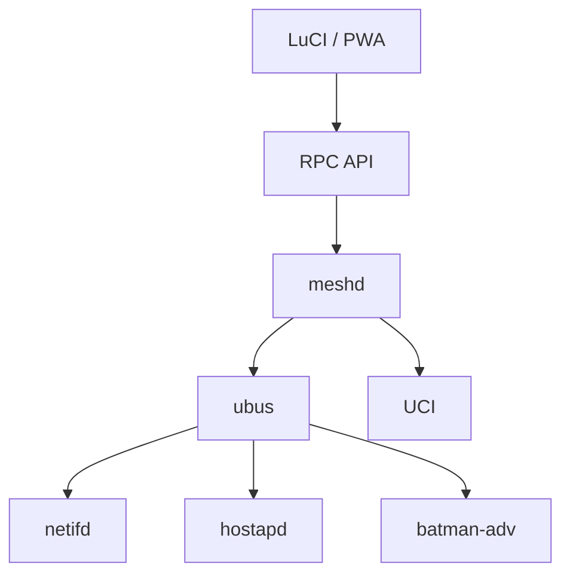
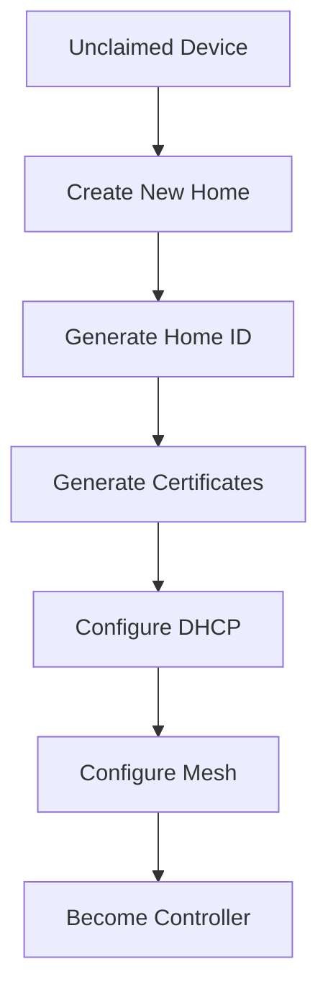
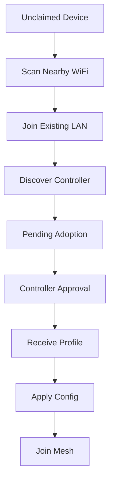
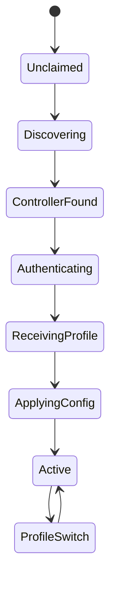
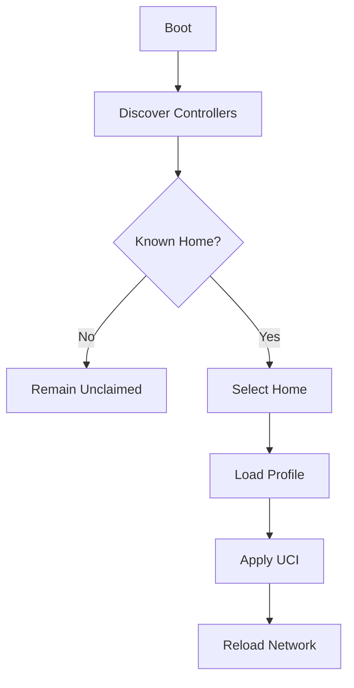
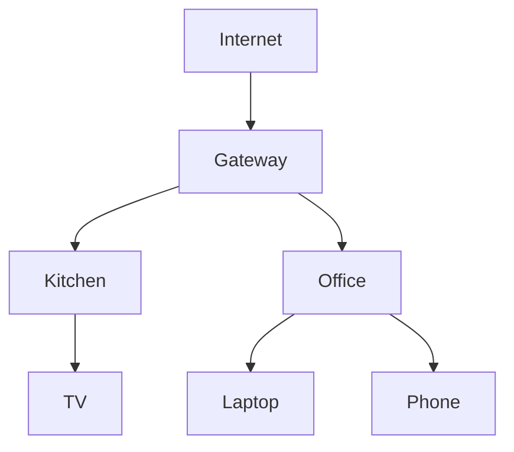

# OpenWrt Mesh Manager (OMM)

## Overview

OpenWrt Mesh Manager (OMM) is a local-first mesh networking management platform for OpenWrt.

Its goal is to make multi-node OpenWrt deployments as easy to manage as commercial mesh products while remaining:

* Open source
* Cloud-independent
* Vendor-neutral
* Self-hosted
* Fully functional without Internet access

OMM provides:

* Simple node enrollment
* Automatic mesh configuration
* Visual topology mapping
* Client-to-AP visibility
* Multi-home portable nodes
* LuCI integration
* Progressive Web App (PWA) support

---

# Goals

## Primary Goals

* Eliminate manual mesh configuration
* Eliminate factory resets when moving nodes between networks
* Eliminate cloud dependencies
* Provide a visual network map
* Provide simple onboarding and adoption workflows

## Non-Goals

* Replace OpenWrt networking stack
* Replace batman-adv
* Replace hostapd
* Replace netifd
* Replace UCI

OMM orchestrates existing OpenWrt services.

---

# Architecture



---

# Components

## meshd

Central orchestration daemon.

Language:

* Go

Responsibilities:

* Discovery
* Enrollment
* Trust management
* Topology collection
* Profile management
* Home selection

Not responsible for:

* Routing
* DHCP
* Wireless drivers

---

## LuCI Application

Responsibilities:

* Dashboard
* Node management
* Topology visualization
* Enrollment workflow
* Settings

Technology:

* JavaScript
* Vue
* Cytoscape.js

---

## PWA

Same frontend codebase.

Runs:

* Embedded in LuCI
* Standalone browser app
* Mobile browser

Implemented as a Vue 3 + TypeScript single-page app (Vite + `vite-plugin-pwa`),
embedded into the `meshd` binary via `//go:embed` and served at the same origin
as the REST API. See [`web/README.md`](web/README.md) for development and build
instructions. Build the full single-binary product (frontend + daemon) with:

```bash
./scripts/build.sh
```

---

# Releases & Installation

Pushing a `v*` tag (e.g. `v0.2.0`) triggers the release workflow, which
cross-compiles `meshd` as a static, CGO-free binary for four ISA groups and
publishes a GitHub Release with per-architecture OpenWrt packages attached.

A single binary is ABI-compatible across every OpenWrt subtarget in its ISA
group, so the same binary is repackaged under each CPU-tuned arch name that
`opkg`/`apk` checks against. The release covers the dominant real-world
subtargets:

| Architecture | OpenWrt package arch (covers) |
|--------------|-------------------------------|
| x86_64 | `x86_64` (VMs, x86 routers) |
| arm64 | `aarch64_generic`, `aarch64_cortex-a53`, `aarch64_cortex-a72` (mvebu, bcm27xx/RPi, mediatek filogic) |
| armv7 | `arm_cortex-a7_neon-vfpv4`, `arm_cortex-a9` (ipq40xx and similar) |
| mipsle | `mipsel_24kc`, `mipsel_74kc` (ramips/mt7621) |

Find your device's arch and install the matching package:

```sh
opkg print-architecture          # 23.05 and earlier
opkg install meshd_<version>_<arch>.ipk

apk info --print-arch            # 24.10+
apk add --allow-untrusted meshd-<version>-<arch>.apk
```

If your subtarget is not listed above, the binary is still compatible within
its ISA group; install with `opkg install --force-architecture`.

---

# Network Model

## Home

A Home is a logical mesh deployment.

Examples:

* Main House
* Summer Cottage
* Parents House

Each Home has:

```text
Home ID
Name
Controller
Mesh Credentials
Certificates
Configuration Profiles
```

---

## Node

A Node is a physical OpenWrt device.

Each node has:

```text
Device Identity
Private Key
Certificate Store
Trusted Homes
Profiles
```

---

## Portable Nodes

Nodes may belong to multiple Homes.

Example:

```text
Node:
  Garage AP

Trusted Homes:
  Home
  Cottage

Current Home:
  Cottage
```

A node may only be active in one Home at a time.

---

# Home Identity

Homes are identified by:

```text
UUID
```

Example:

```text
8f53dc9e-42e1-4d8d-a379-ef2f5c6c5f41
```

SSID names are not authoritative.

A Home may change:

* SSID
* Password
* Controller

without changing Home identity.

---

# Controller Model

A Controller is a node currently acting as coordinator.

Responsibilities:

* Profile distribution
* Enrollment approval
* Certificate signing
* Topology aggregation

Controllers are local-only.

No cloud component exists.

---

# Controller Discovery

Discovery methods:

1. mDNS
2. UDP Broadcast
3. Future: LLDP

Service Advertisement:

```text
_mesh._tcp.local
```

Controller broadcasts:

```json
{
  "home_id": "8f53dc9e",
  "name": "Home",
  "controller_id": "gw01"
}
```

---

# First Boot

Default state:

```text
UNCLAIMED
```

Device starts:

```text
SSID:
OpenWrt-Setup-XXXX

IP:
192.168.254.1
```

Web UI options:

```text
Create New Home
Join Existing Home
Advanced OpenWrt Setup
```

---

# Create New Home

Workflow:



---

# Join Existing Home

Workflow:



---

# Enrollment State Machine



---

# Profile System

Each Home has an independent profile.

Example:

```text
Home
 ├── Node Name: Garage
 ├── VLANs
 ├── Firewall
 └── Mesh Settings

Cottage
 ├── Node Name: Guest House
 ├── VLANs
 ├── Firewall
 └── Mesh Settings
```

---

# Profile Storage

Directory Layout:

```text
/etc/meshd/

homes/
 ├── home/
 ├── cottage/
 └── parents/

active-home
```

Each Home contains:

```text
metadata.json
wireless.json
network.json
mesh.json
```

---

# Profile Switching

Nodes scan for controllers.

Selection order:

1. Last Active Home
2. Strongest Signal
3. User Selection

Workflow:



---

# Multi-Home Support

Supported:

```text
Home
Cottage
Parents
```

Unsupported:

```text
Simultaneous Active Membership
```

Reason:

Avoid conflicting:

* DHCP
* VLANs
* Firewall rules
* Routing

---

# Topology Collection

Sources:

```text
batctl
hostapd
iw
ubus
```

Collected Data:

```text
Node Links
RSSI
Throughput
Clients
Routes
```

---

# Topology View



---

# Client Mapping

Example:

```json
{
  "client": "Laptop",
  "ap": "Office",
  "signal": -51,
  "band": "5GHz"
}
```

UI displays:

```text
Client
Connected AP
Signal
Traffic
Roaming History
```

---

# UBUS API

## Status

```text
meshd.status
```

Returns:

```json
{
  "state": "active",
  "home": "Home"
}
```

---

## Topology

```text
meshd.topology
```

Returns graph data. The HTTP API exposes this as `GET /topology`: mesh nodes,
batman-adv links with transmit quality (TQ), and associated clients with signal
(RSSI), band and tx/rx rates. Sources are `batctl o` (originators) and hostapd
`get_clients` over ubus; the PWA renders it with Cytoscape.js.

Topology is aggregated across the mesh: each node periodically pushes its local
view to the controllers it has joined (`POST /topology/report`), and a
controller's `GET /topology` merges its own view with fresh member reports
(deduplicating nodes/links/clients, keeping the strongest TQ per link). A leaf
node's `GET /topology` shows just its local view.

---

## Nodes

```text
meshd.nodes
```

Returns node inventory.

---

## Adopt

```text
meshd.adopt
```

Approves enrollment.

---

## Scan

```text
meshd.scan
```

Discovers controllers and networks. The HTTP API exposes this as `GET /scan`,
returning nearby controllers (Homes) the daemon has heard announce. Each daemon
passively listens for UDP announcements into a short-lived cache, so the scan
answers instantly; the PWA's enrollment screen lists the results to join with
one click instead of typing a controller URL.

---

# Security Model

Authentication:

* Mutual TLS
* Home-issued certificates

Enrollment:

* Controller approval required

Certificates:

* Stored per Home

Trust:

* Home-based trust model

No cloud authentication.

---

# Future Features

## Node Health

```text
Health Score
Link Quality
Retransmissions
Congestion
```

---

## Placement Assistant

Recommend improved node placement using:

* RSSI
* Throughput
* Route quality

---

## Firmware Management

Controller distributes:

* Stable channel
* Beta channel
* Scheduled upgrades

---

# Success Criteria

A user should be able to:

1. Flash OpenWrt
2. Open setup page
3. Create Home
4. Add additional node
5. Approve adoption
6. View topology

without manually configuring:

* 802.11s
* batman-adv
* Bridges
* Firewall zones
* Routing
* VLANs

The user should think in terms of:

```text
Homes
Nodes
Clients
```

rather than networking internals.
