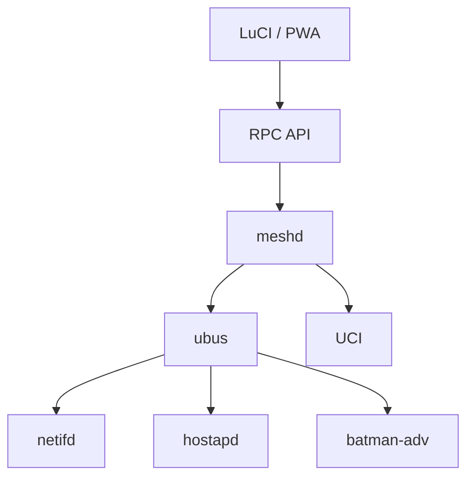

# Architecture & Components

How OMM is structured and what each component is responsible for. See the
[README](../README.md) for the project overview.

---

## Architecture



---

## Components

### meshd

Central orchestration daemon.

Language:

* Go

Responsibilities:

* Discovery
* Enrollment
* Trust management
* Topology collection
* Profile management
* Home selection

Not responsible for:

* Routing
* DHCP
* Wireless drivers

meshd **authors** the network config that wires these up but never forwards a
packet itself: it sets the UCI/netifd sections and lets the kernel and daemons
do the work.

### batman-adv

The mesh forwarding layer. meshd does not implement routing; it authors a
batman-adv mesh via UCI/netifd (the `batadv` / `batadv_hardif` netifd protocols)
and the kernel module does loop-free, multi-hop layer-2.5 forwarding:

* A `bat0` **soft interface** with **bridge-loop-avoidance** on, bridged into
  `br-lan`.
* A **hard interface** per backhaul link — the 802.11s mesh vif and each wired
  backhaul port — enslaved to `bat0`.

Because batman-adv forwards across any mix of wired and wireless links, multi-hop
chains and simultaneous wired+wireless backhaul on one node work without meshd
arbitrating paths. See [network-model.md](network-model.md#batman-adv-routing-layer).

### LuCI Application

Responsibilities:

* Dashboard
* Node management
* Topology visualization
* Enrollment workflow
* Settings

Technology:

* JavaScript
* Vue
* Cytoscape.js

### PWA

Same frontend codebase.

Runs:

* Embedded in LuCI
* Standalone browser app
* Mobile browser

Implemented as a Vue 3 + TypeScript single-page app (Vite + `vite-plugin-pwa`),
embedded into the `meshd` binary via `//go:embed` and served at the same origin
as the REST API. See [`web/README.md`](../web/README.md) for development and
build instructions. Build the full single-binary product (frontend + daemon)
with:

```bash
./scripts/build.sh
```
