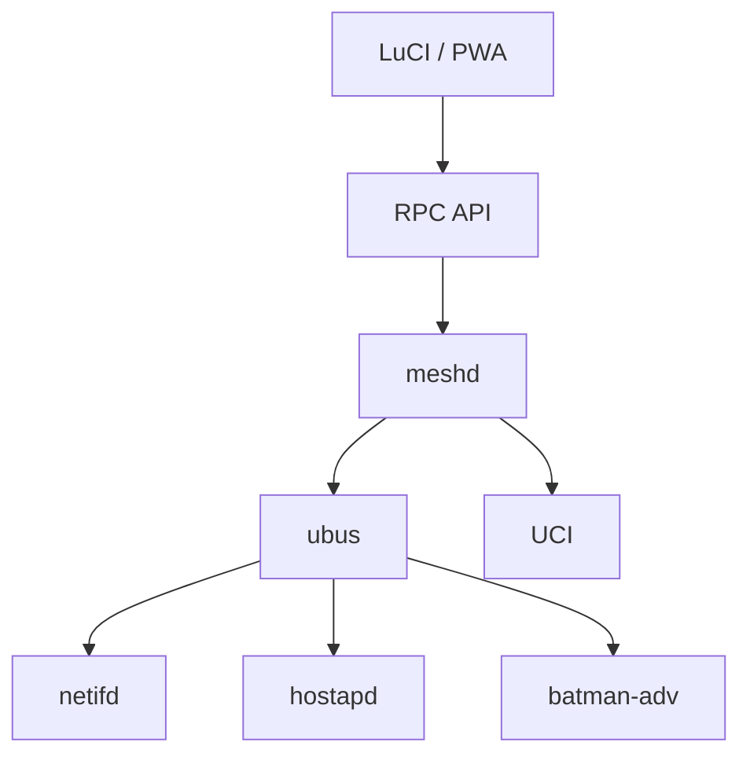

# Architecture & Components

How OMM is structured and what each component is responsible for. See the
[README](../README.md) for the project overview.

---

## Architecture



---

## Components

### meshd

Central orchestration daemon.

Language:

* Go

Responsibilities:

* Discovery
* Enrollment
* Trust management
* Topology collection
* Profile management
* Home selection

Not responsible for:

* Routing
* DHCP
* Wireless drivers

### LuCI Application

Responsibilities:

* Dashboard
* Node management
* Topology visualization
* Enrollment workflow
* Settings

Technology:

* JavaScript
* Vue
* Cytoscape.js

### PWA

Same frontend codebase.

Runs:

* Embedded in LuCI
* Standalone browser app
* Mobile browser

Implemented as a Vue 3 + TypeScript single-page app (Vite + `vite-plugin-pwa`),
embedded into the `meshd` binary via `//go:embed` and served at the same origin
as the REST API. See [`web/README.md`](../web/README.md) for development and
build instructions. Build the full single-binary product (frontend + daemon)
with:

```bash
./scripts/build.sh
```
