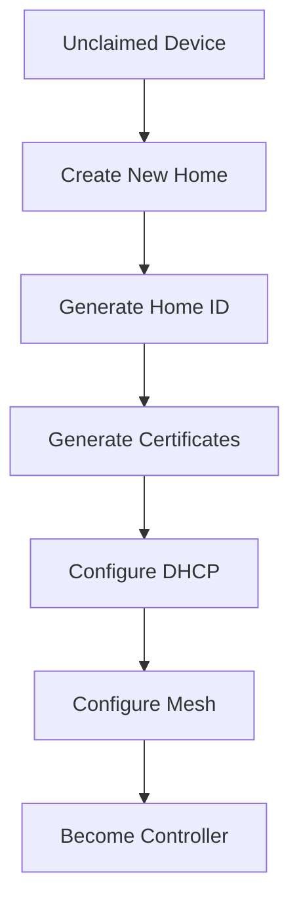
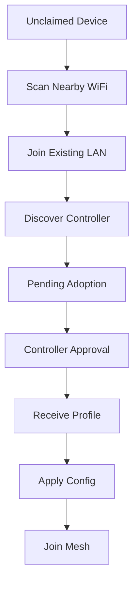
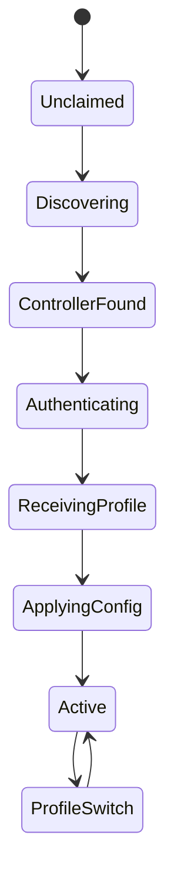

# Discovery & Enrollment

The conceptual flow from an unclaimed device to an active mesh member:
controller discovery, first boot, creating or joining a Home, and the
enrollment state machine. For the wire-level contract (messages, sequence,
error handling) see the [Node Enrollment Protocol](enrollment.md). See the
[README](../README.md) for the project overview.

---

## Controller Discovery

Discovery methods:

1. mDNS
2. UDP Broadcast
3. Future: LLDP

Service Advertisement:

```text
_mesh._tcp.local
```

Controller broadcasts:

```json
{
  "home_id": "8f53dc9e",
  "name": "Home",
  "controller_id": "gw01",
  "api": "https://0.0.0.0:8081"
}
```

The `api` field tells joiners where to reach the controller's mesh control
plane. A controller announces its *bind* address, which is usually the
unspecified `0.0.0.0`; the listener fills the real host from the **UDP packet's
source address**, so a joiner gets a dialable URL with **no per-device
configuration**. (Set `MESHD_API_ADVERTISE` to override with an explicit URL.)

Because UDP broadcast is confined to a single L2 segment, this zero-config
discovery works between devices on the same bridged LAN — e.g. a wired
controller (even one with no radios, such as a Raspberry Pi) and a wifi AP
plugged into the same network. Across a router, use an explicit join URL
(`MESHD_JOIN` / the enrollment UI).

> An unclaimed node is a router by default (routed, firewalled `wan`), which is
> *not* on the controller's bridged LAN and drops the discovery broadcast. The
> [network posture](network-posture.md) model fixes this: while unclaimed a node
> takes the **Guest** dumb-AP posture (uplink bridged into `lan`), so it is
> L2-adjacent to the controller and discovery works.

---

## First Boot

Default state:

```text
UNCLAIMED
```

Device starts:

```text
SSID:
OpenWrt-Setup-XXXX

IP:
192.168.254.1
```

Web UI options:

```text
Create New Home
Join Existing Home
Advanced OpenWrt Setup
```

### Wired auto-onboard

An unclaimed node that is **on the wire** can skip the wizard entirely. When
`MESHD_AUTO_ONBOARD_WIRED` is enabled (UCI `auto_onboard_wired '1'`), the daemon
watches for the conditions to onboard unattended: the node is still unclaimed,
its ethernet backhaul is up (see `MESHD_BACKHAUL_IFACE` in
[Topology](topology.md#backhaul-type)), and a controller other than its own Home
has been discovered. When they all hold it enrolls into that controller — the
lowest discovered `home_id`, chosen deterministically — applies the returned
profile, marks setup complete and tears down the first-boot setup AP.

It is **opt-in** (default off): a freshly-flashed node on an untrusted LAN should
not silently join whatever controller happens to be announcing. It runs only
when no explicit `MESHD_JOIN` controllers are configured, so it never races an
operator's configured joins. And because completion is unattended, the join only
finishes without a human when the **controller's adopt policy** allows it (see
below); otherwise the node waits in `pending_approval` until an operator approves
it.

### Adoption policy (controller-side trust)

Whether a node is adopted is the **controller's** decision, never the node's —
an enrolling node can claim anything, so trust is gated on what the controller
can *observe*, not on the node's self-declared backhaul. The controller's
`adopt_policy` (`MESHD_ADOPT_POLICY`):

| Policy | Behaviour |
|--------|-----------|
| `off` (default) | Never auto-adopt; an operator approves each node. |
| `onlink` | Auto-adopt only nodes whose enrollment arrives on the controller's **own LAN subnet** (verified from the request source — physically on the home network). Recommended for a kit. |
| `always` | Auto-adopt any node that enrolls, from anywhere (trusted lab / test). |

`onlink` is the safe enabler for plug-and-play: a node cabled into the home is
adopted automatically, while one across a router or on the WAN side is not —
without trusting the node's word about being "wired". (The legacy
`MESHD_AUTO_ADOPT=1` still maps to `always` for compatibility.)

**Boot ordering (grace window).** A node must not select its own (last-resort)
Home before discovery has had a chance to surface a controller — otherwise
`activeHome` is set, and auto-onboard never fires. So when auto-onboard is
enabled the daemon does **not** self-select at boot; the onboard loop tries to
enroll first, and only after `MESHD_ONBOARD_GRACE` (UCI `onboard_grace`, default
`20s`) elapses with **no controller discovered** does it fall back to selecting
its own Home — i.e. become its own controller. A reachable-but-not-yet-adopting
controller keeps the node retrying rather than falling back. This is the
"scan on boot, then decide role" behaviour: join if a home is found, become a
controller if none is.

---

## Create New Home

Workflow:



---

## Join Existing Home

Workflow:



---

## Enrollment State Machine


