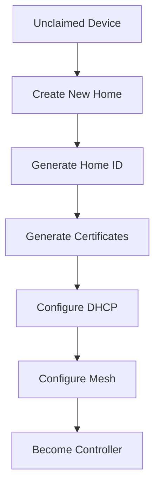
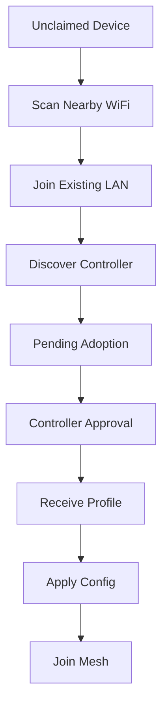
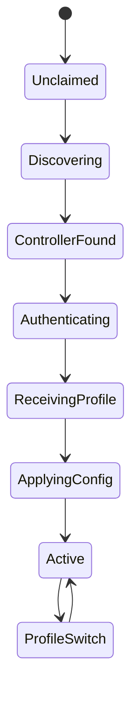

# Discovery & Enrollment

The conceptual flow from an unclaimed device to an active mesh member:
controller discovery, first boot, creating or joining a Home, and the
enrollment state machine. For the wire-level contract (messages, sequence,
error handling) see the [Node Enrollment Protocol](enrollment.md). See the
[README](../README.md) for the project overview.

---

## Controller Discovery

Discovery methods:

1. mDNS
2. UDP Broadcast
3. Future: LLDP

Service Advertisement:

```text
_mesh._tcp.local
```

Controller broadcasts:

```json
{
  "home_id": "8f53dc9e",
  "name": "Home",
  "controller_id": "gw01"
}
```

---

## First Boot

Default state:

```text
UNCLAIMED
```

Device starts:

```text
SSID:
OpenWrt-Setup-XXXX

IP:
192.168.254.1
```

Web UI options:

```text
Create New Home
Join Existing Home
Advanced OpenWrt Setup
```

---

## Create New Home

Workflow:



---

## Join Existing Home

Workflow:



---

## Enrollment State Machine


