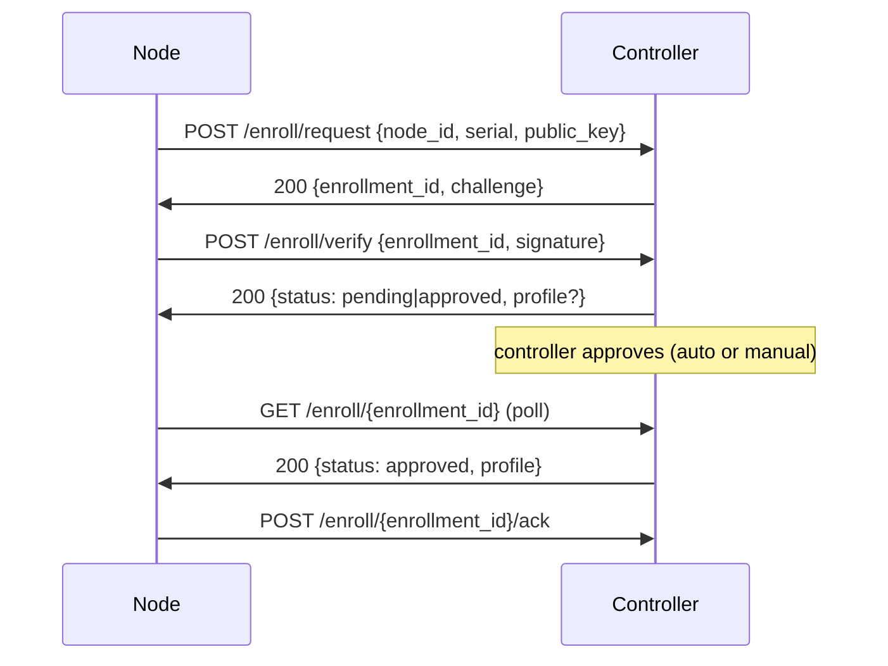

# Node Enrollment Protocol

This document specifies the discovery + enrollment flow between an unclaimed
**node** and a **controller**, implementing the state machine and sequence
described in the [README](../README.md). It is the contract exercised by the
container-based end-to-end tests.

## Roles are not a startup mode

There is no fixed controller/client role. Every `meshd` daemon:

- **controls its own Home** — it announces itself, accepts enrollment requests,
  approves (adopts) nodes, and distributes profiles for `MESHD_HOME_ID`; and
- **can enroll into other controllers as a node** — a runtime action, triggered
  by `POST /enroll/join` or the `MESHD_JOIN` startup list.

So a single device can be the controller of one Home and a member node of N
other Homes at the same time. Membership spans many Homes, but a device is only
ever **active** in one Home at a time (one applied profile); joining adds
membership, it does not switch the active Home.

Every daemon carries a persistent **device identity**: an ECDSA P-256 key pair
and a self-signed certificate, generated on first start and stored under
`/etc/meshd/identity/` (`key.pem`, `cert.pem`). The node ID is the lowercase
hex SHA-256 of the DER public key.

### Joining another Home

```
POST /enroll/join { "controller_url": "http://other:8080", "serial": "..." }
```

The daemon runs the request → verify → approve → ack exchange below against the
target controller, using its own device identity, and returns the final result.

## Discovery

The controller announces itself periodically over UDP broadcast on
`MESHD_UDP_LISTEN` (default `:45678`):

```json
{ "home_id": "8f53dc9e-…", "name": "Home", "controller_id": "gw01", "api": "http://10.0.0.1:8080" }
```

A client listens for announcements and learns the controller's HTTP `api`
endpoint. (mDNS `_mesh._tcp` discovery is supported in parallel and resolves to
the same endpoint; UDP is the baseline used by the e2e tests.)

## Enrollment (HTTP)

All enrollment endpoints live under `/enroll` on the controller API.



### Messages

| Step | Request | Response |
| ---- | ------- | -------- |
| request | `{node_id, serial, public_key}` — `public_key` is base64 DER (SPKI) | `{enrollment_id, challenge}` — `challenge` is base64 random nonce (32 bytes) |
| verify | `{enrollment_id, signature}` — base64 ASN.1 ECDSA signature over the SHA-256 digest of the challenge | `{status, profile?}` |
| poll | `GET /enroll/{enrollment_id}` | `{status, profile?}` |
| ack | `POST /enroll/{enrollment_id}/ack` | `{status: "active"}` |

`status` ∈ `pending_verification` → `pending_approval` → `approved` → `active`
(plus `rejected`). The controller verifies the signature against the submitted
public key before advancing past `pending_verification`; a node whose `node_id`
does not match the SHA-256 of its public key is rejected.

### Approval

After verification the node is `pending_approval`. Approval is performed by:

- `POST /nodes/{node_id}/adopt` (the `meshd.adopt` action), or
- automatically when the controller runs with `MESHD_AUTO_ADOPT=1`.

Auto-adopt exists so the e2e suite can enroll many nodes without manual
interaction; production defaults to manual approval.

## Node state machine

Implemented with `github.com/qmuntal/stateless`:

```
Unclaimed → Discovering → ControllerFound → Enrolling
          → PendingApproval → Active   (also → Rejected, → Failed)
```

## Concurrency

Many nodes may enroll simultaneously. The controller must handle concurrent
`/enroll/request` and `/adopt` calls without data races or `database is locked`
errors; the storage layer is configured for concurrent access (WAL +
`busy_timeout`, serialized writes). The e2e suite asserts that N clients
enrolling in parallel all reach `active` and appear exactly once in
`GET /nodes`.

## End-to-end test topology

The e2e suite (testcontainers-go, build tag `e2e`) runs against real OpenWrt
container images with the built package installed:

- **23.05** image + `opkg install meshd_*.ipk` (a real opkg package: a gzip tar
  of `debian-binary`/`control.tar.gz`/`data.tar.gz`)
- **24.10** image + the `.apk` extracted onto the rootfs. The repo's `.apk` is a
  plain gzip tar rather than a signed apk package, so it is installed by
  extraction; producing a real signed apk is future work.

One controller container (`MESHD_ROLE=controller`, `MESHD_AUTO_ADOPT=1`) and N
client containers (`MESHD_ROLE=client`) are started; the test asserts all
clients converge to `active` and the controller's node inventory matches.

Run locally (Docker, or a podman socket via `DOCKER_HOST`):

```sh
./scripts/build.sh && ./scripts/package-ipk.sh && ./scripts/package-apk.sh
go test -tags e2e -timeout 25m ./internal/e2e/...
```
