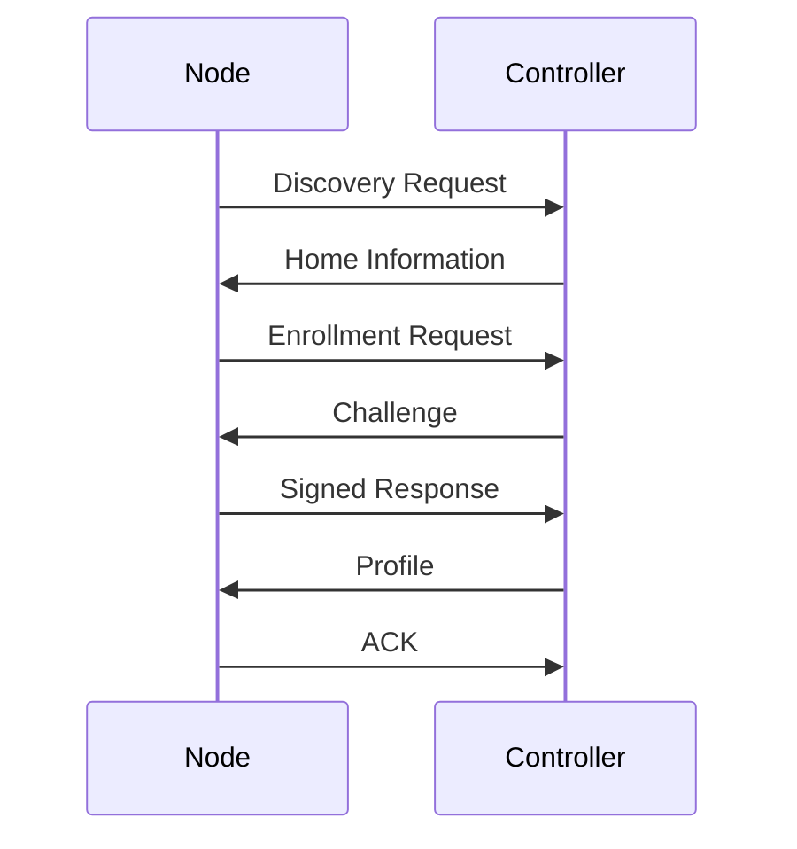
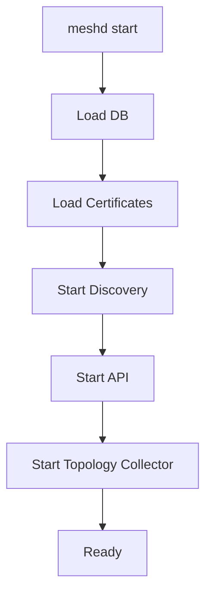

# OpenWrt Mesh Manager (OMM) - Go Implementation Appendix

This appendix extends the specification with implementation guidance for Go.

---

# Design Principles

## Prefer Libraries Over Shelling Out

Avoid:

```go
exec.Command("ubus", "call", "network.interface", "dump")
```

except during prototyping.

Preferred:

```go
ubusClient.Call(...)
```

Advantages:

* Better error handling
* Lower latency
* No process spawning
* Easier testing
* Less memory overhead
* Better integration with long-running daemons

---

# Suggested Project Layout

```text
meshd/

├── cmd/
│   └── meshd/
│       └── main.go
│
├── internal/
│   ├── api/
│   ├── config/
│   ├── controller/
│   ├── discovery/
│   ├── enrollment/
│   ├── profiles/
│   ├── topology/
│   ├── ubus/
│   ├── wireless/
│   └── storage/
│
├── pkg/
│   └── models/
│
├── web/
│
├── configs/
│
└── scripts/
```

---

# Core Data Structures

## Home

```go
type Home struct {
    ID          string
    Name        string
    Controller  string
    Certificate []byte
}
```

---

## Node

```go
type Node struct {
    ID           string
    Serial       string
    CurrentHome  string

    TrustedHomes []string

    LastSeen time.Time
}
```

---

## Profile

```go
type Profile struct {
    HomeID string

    NodeName string

    MeshSSID string

    MeshKey string

    VLANs []VLAN
}
```

---

# Discovery Service

## Recommended Libraries

### mDNS

Preferred:

```go
github.com/grandcat/zeroconf
```

Example:

```go
resolver, err := zeroconf.NewResolver(nil)

entries := make(chan *zeroconf.ServiceEntry)

go func() {
    for entry := range entries {
        log.Printf(
            "controller %s at %s",
            entry.Instance,
            entry.AddrIPv4,
        )
    }
}()

resolver.Browse(
    ctx,
    "_mesh._tcp",
    "local.",
    entries,
)
```

---

## UDP Broadcast

Go stdlib is sufficient.

```go
conn, err := net.ListenUDP(
    "udp4",
    &net.UDPAddr{
        Port: 45678,
    },
)
```

Controller announcement:

```json
{
  "home_id":"abc123",
  "controller_id":"gw01"
}
```

---

# Storage Layer

## Preferred Database

For MVP:

```text
SQLite
```

Recommended:

```go
modernc.org/sqlite
```

Advantages:

* Pure Go
* No CGO
* Cross-compiles cleanly
* Good OpenWrt compatibility

---

Example:

```go
db, err := sql.Open(
    "sqlite",
    "/etc/meshd/meshd.db",
)
```

---

## Homes Table

```sql
CREATE TABLE homes (
    id TEXT PRIMARY KEY,
    name TEXT,
    last_connected INTEGER
);
```

---

## Nodes Table

```sql
CREATE TABLE nodes (
    id TEXT PRIMARY KEY,
    home_id TEXT,
    last_seen INTEGER
);
```

---

# HTTP API

Recommended:

```go
github.com/go-chi/chi/v5
```

Avoid:

* Gin
* Echo

for embedded environments.

---

Example:

```go
r := chi.NewRouter()

r.Get("/api/status", statusHandler)
r.Get("/api/topology", topologyHandler)
```

---

# Configuration Layer

## UCI Management

Preferred architecture:

```text
meshd
    →
internal/config
    →
uci package
```

Do not generate config files manually.

---

Example Interface

```go
type UCI interface {
    Set(
        pkg string,
        section string,
        option string,
        value string,
    ) error

    Commit(pkg string) error
}
```

---

## Example

```go
uci.Set(
    "wireless",
    "mesh0",
    "ssid",
    "HomeMesh",
)

uci.Commit("wireless")
```

---

# UBUS Integration

This is one of the most important pieces.

Preferred:

Native ubus bindings.

Avoid:

```go
exec.Command("ubus")
```

for production.

---

## Interface

```go
type UbusClient interface {
    Call(
        object string,
        method string,
        req any,
        resp any,
    ) error
}
```

---

## Example

```go
var result InterfaceDump

err := ubus.Call(
    "network.interface",
    "dump",
    nil,
    &result,
)
```

---

# Topology Collection

## Batman-adv

Current reality:

Batman mostly exposes data through:

```text
batctl
```

There is no widely adopted Go library.

Two options:

### MVP

Use:

```go
exec.Command("batctl", "o")
```

only inside topology package.

Encapsulate completely.

---

### Long Term

Read:

```text
/sys/kernel/debug/batman_adv/
```

directly.

Example:

```go
type Neighbor struct {
    Node string
    TQ   int
}
```

---

# Wireless Metrics

Prefer:

```text
ubus
```

over parsing command output.

Example:

```go
ubus.Call(
    "hostapd.wlan0",
    "get_clients",
    nil,
    &clients,
)
```

---

Client model:

```go
type Client struct {
    MAC string

    RSSI int

    TxRate int

    RxRate int
}
```

---

# Enrollment Protocol

## Controller Discovery



---

# Certificates

Recommended:

Use Go standard library.

```go
crypto/x509
crypto/ecdsa
```

Generate device identity:

```go
priv, err := ecdsa.GenerateKey(
    elliptic.P256(),
    rand.Reader,
)
```

Create certificate:

```go
certDER, err := x509.CreateCertificate(
    rand.Reader,
    template,
    ca,
    &priv.PublicKey,
    caKey,
)
```

---

# Profile Switching

Example:

```go
func SwitchHome(
    homeID string,
) error {

    profile, err := profiles.Load(homeID)

    if err != nil {
        return err
    }

    err = config.Apply(profile)

    if err != nil {
        return err
    }

    return network.Reload()
}
```

---

# State Machine

Recommended library:

```go
github.com/qmuntal/stateless
```

Example:

```go
machine := stateless.NewStateMachine(
    StateUnclaimed,
)

machine.Configure(
    StateUnclaimed,
).Permit(
    TriggerDiscover,
    StateDiscovering,
)
```

---

# Event Bus

Recommended:

```go
github.com/asaskevich/EventBus
```

or simple channels.

Example:

```go
type Event struct {
    Type string
    Data any
}

events := make(chan Event, 128)
```

---

# Logging

Recommended:

```go
log/slog
```

Example:

```go
logger.Info(
    "controller discovered",
    "home",
    homeID,
    "ip",
    ip,
)
```

---

# Service Startup



---

# OpenWrt Package Layout

```text
/usr/bin/meshd

/etc/init.d/meshd

/etc/config/meshd

/etc/meshd/

/usr/share/meshd/
```

---

# MVP Implementation Order

1. Discovery
2. Home database
3. Enrollment
4. Profile switching
5. UBUS integration
6. Topology collection
7. HTTP API
8. LuCI frontend
9. Portable node support
10. PWA

This order allows a usable mesh enrollment system long before the topology visualization is complete.
