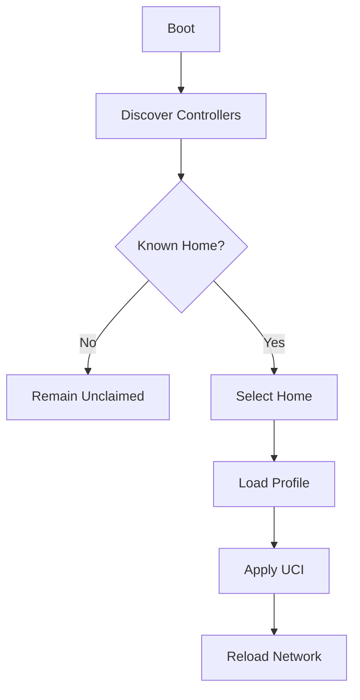

# Profiles

Per-Home configuration: what a profile contains, how it is stored on disk, and
how a node switches between Homes. See the [README](../README.md) for the
project overview.

---

## Profile System

Each Home has an independent profile.

Example:

```text
Home
 ├── Node Name: Garage
 ├── VLANs
 ├── Firewall
 └── Mesh Settings

Cottage
 ├── Node Name: Guest House
 ├── VLANs
 ├── Firewall
 └── Mesh Settings
```

---

## Profile Storage

Directory Layout:

```text
/etc/meshd/

homes/
 ├── home/
 ├── cottage/
 └── parents/

active-home
```

Each Home contains:

```text
metadata.json
wireless.json
network.json
mesh.json
```

---

## Profile Switching

Nodes scan for controllers.

Selection order:

1. Last Active Home
2. Strongest Signal
3. User Selection

Workflow:


