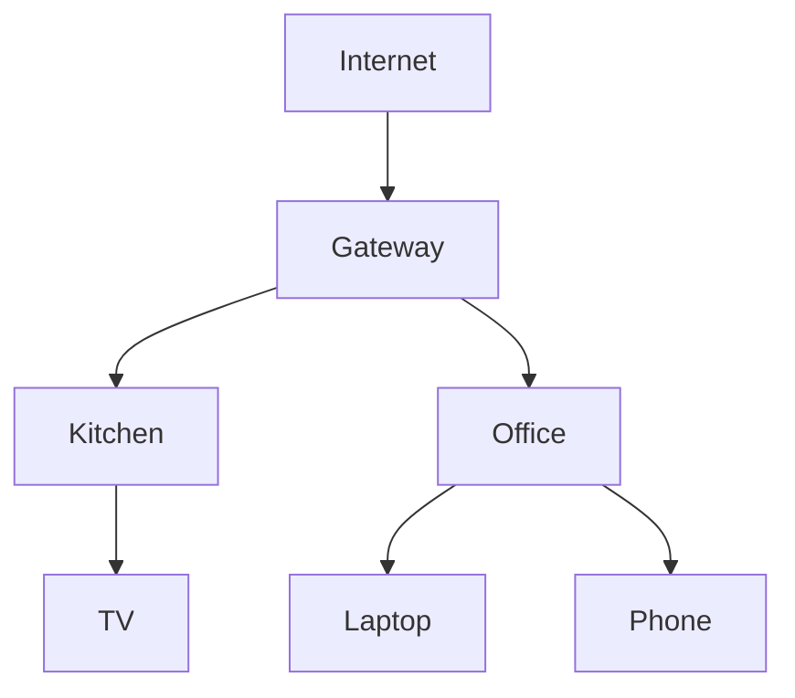

# Topology

How OMM collects, aggregates, and visualizes the live mesh graph, including
client-to-AP mapping. The HTTP surface is documented in the [API](api.md). See
the [README](../README.md) for the project overview.

---

## Topology Collection

Sources:

```text
batctl
hostapd
iw
ubus
```

Collected Data:

```text
Node Links
RSSI
Throughput
Clients
Routes
Backhaul (ethernet | wireless)
```

---

## Backhaul Type

Each node reports how it reaches the rest of the mesh — over a wired ethernet
uplink or over the wireless mesh. The daemon classifies this by inspecting a
configured uplink interface under `/sys/class/net/<iface>`: `carrier`/`operstate`
up means `ethernet`, configured-but-down means `wireless`, and no interface
configured (or an unreadable one) means `unknown`.

Set the uplink interface with `MESHD_BACKHAUL_IFACE` (e.g. `eth0`). It is empty
by default — there is no universal ethernet interface name — so backhaul reads
`unknown` until configured.

The value rides on each node's `self` node in its topology report and is
preserved by the aggregator when that node is merged into the controller's
mesh-wide graph, surfaced as the `backhaul` field on a topology node:

```json
{ "id": "...", "label": "Kitchen", "role": "node", "backhaul": "wireless" }
```

The Topology view marks wired nodes with a solid border and wireless nodes with
a dashed border.

---

## Topology View



---

## Client Mapping

Example:

```json
{
  "client": "Laptop",
  "ap": "Office",
  "signal": -51,
  "band": "5GHz"
}
```

UI displays:

```text
Client
Connected AP
Signal
Traffic
Roaming History
```
