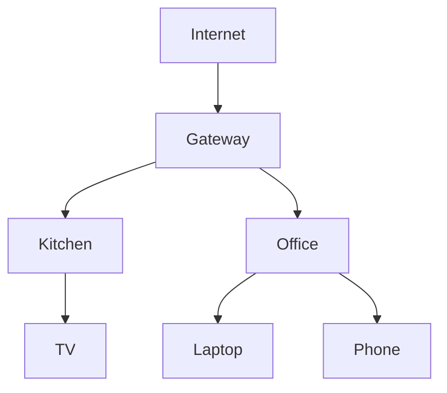

# Topology

How OMM collects, aggregates, and visualizes the live mesh graph, including
client-to-AP mapping. The HTTP surface is documented in the [API](api.md). See
the [README](../README.md) for the project overview.

---

## Topology Collection

Sources:

```text
batctl
hostapd
iw
ubus
```

Collected Data:

```text
Node Links
RSSI
Throughput
Clients
Routes
```

---

## Topology View



---

## Client Mapping

Example:

```json
{
  "client": "Laptop",
  "ap": "Office",
  "signal": -51,
  "band": "5GHz"
}
```

UI displays:

```text
Client
Connected AP
Signal
Traffic
Roaming History
```
