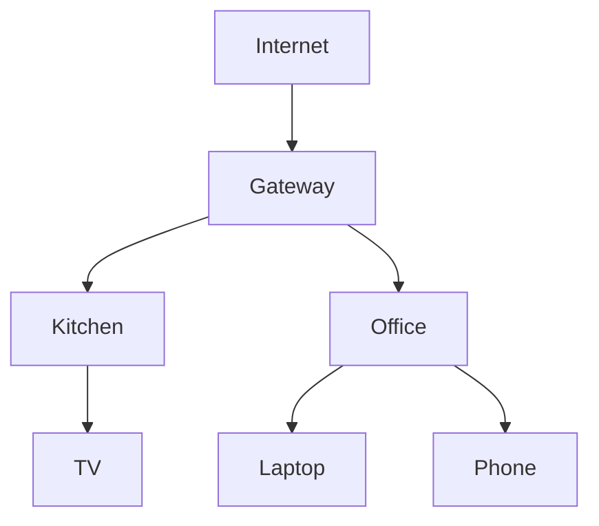

# Topology

How OMM collects, aggregates, and visualizes the live mesh graph, including
client-to-AP mapping. The HTTP surface is documented in the [API](api.md). See
the [README](../README.md) for the project overview.

---

## Topology Collection

Sources:

```text
batctl
hostapd
iw
ubus
```

Collected Data:

```text
Node Links
RSSI
Throughput
Clients
Routes
Backhaul (ethernet | wireless)
```

---

## Backhaul Type

Each node reports how it reaches the rest of the mesh — over a wired ethernet
uplink or over the wireless mesh. The daemon classifies this by inspecting a
configured uplink interface under `/sys/class/net/<iface>`: `carrier`/`operstate`
up means `ethernet`, configured-but-down means `wireless`, and no interface
configured (or an unreadable one) means `unknown`.

Set the uplink interface with `MESHD_BACKHAUL_IFACE` (e.g. `eth0`). It is empty
by default — there is no universal ethernet interface name — so backhaul reads
`unknown` until configured.

The value rides on each node's `self` node in its topology report and is
preserved by the aggregator when that node is merged into the controller's
mesh-wide graph, surfaced as the `backhaul` field on a topology node:

```json
{ "id": "...", "label": "Kitchen", "role": "node", "backhaul": "wireless" }
```

The Topology view marks wired nodes with a solid border and wireless nodes with
a dashed border.

---

## Link Identity (MAC ↔ node reconciliation)

batman-adv lists neighbours by their **originator MAC** — the MAC of the *hard
interface* the OGMs arrive on — but every node self-reports its graph under its
**node ID**. Left unreconciled, a controller's link points at an anonymous MAC
blob and the real nodes never connect — there are no lines between them.

A node has **more than one** such MAC. Its `bat0` MAC usually equals the wireless
mesh hardif MAC, but each wired backhaul port is a separate batman hardif with
its own unique, locally-administered MAC (assigned by `batman.uniqueHardifMAC` so
shared-MAC DSA ports don't collide). So a node with a wired link appears in
`batctl o` under several originator MACs. Reporting only the `bat0` MAC left the
wired-port originators unmapped, so they survived as phantom "separate node"
vertices — one per ethernet port.

To fix this each node reports **all** the batman addresses it is known by, on its
`self` vertex:

```json
{ "id": "n1", "label": "Kitchen", "role": "self", "addrs": ["aa:bb:cc:dd:ee:01", "02:bb:cc:dd:ee:99"] }
```

The aggregator builds a MAC→node-ID index from every report's `addrs`, rewrites
each link's MAC endpoints to the owning node ID, and drops the now-redundant MAC
nodes. A MAC no node has claimed is left as-is (an as-yet-unknown node). The
addresses are enumerated from `batctl if` (each enslaved hard interface) plus
`bat0` itself, reading each device's MAC from `/sys/class/net/<dev>/address`.

---

## Link Type and Quality

Each mesh link carries the medium it runs over and a quality metric, so the view
can distinguish a wired backhaul from a wireless hop:

```json
{ "source": "ctrl", "target": "n1", "tq": 255, "kind": "wired",     "speed_mbps": 2500 }
{ "source": "ctrl", "target": "n2", "tq": 200, "kind": "wireless",  "signal": -58 }
```

`kind` is derived from the link's outgoing batman hard interface (parsed from the
`[outgoingIF]` column of `batctl o`): an interface with a `phy80211` in sysfs is
`wireless`, otherwise `wired`. A wired link reads its negotiated speed from
`/sys/class/net/<iface>/speed` (Mbps); a wireless link reads the next-hop peer's
RSSI from `iw dev <iface> station dump`. Both degrade to absent when the tools
or files are unavailable.

The Topology view draws **wired links solid**, labelled with the speed
(`1G`/`2.5G`/`5G`/`10G`), and **wireless links dashed**, coloured by RSSI quality
(`excellent`/`good`/`fair`/`weak`) and labelled with the signal (`-58 dBm · good`).
A link of unknown medium falls back to a batman `TQ` label.

---

## Node Liveness (onboarded vs alive)

A node that has onboarded but is not currently reporting — powered off, meshd
down, or the mesh failed to form — used to **vanish** from the graph: the
aggregator dropped reports older than its freshness window and the node simply
disappeared, giving no signal that something is wrong (#29).

The aggregator now keeps onboarded nodes visible and tags each with a `status`
and a `last_seen` (unix seconds):

```json
{ "id": "n3", "label": "Hallway", "role": "node", "status": "stale", "last_seen": 1718539200 }
```

- **`alive`** — reporting within the freshness window (`ttl`, 90 s). Alive nodes
  contribute their links and clients to the graph as before.
- **`stale`** — last heard from past `ttl` but within the stale window
  (`staleTTL`, 5 min). Shown as an isolated, dimmed vertex; its now-untrustworthy
  links are **not** merged.
- **`down`** — onboarded but silent beyond `staleTTL`, or never reported. Shown
  isolated, greyed with a red dashed border.

The set of onboarded nodes comes from the controller's node inventory, **scoped
to the home it controls** (a node belonging to another home is never surfaced).
Live reports win: a node both onboarded and reporting fresh stays `alive` and
appears once. This is a pure liveness signal (no ARP/neighbour probing yet — a
possible follow-up); it does not depend on internet connectivity.

The Topology view dims a `stale` node and crosses out a `down` node (`✕`
suffix), labelling both with how long ago they were last seen (`Hallway · 2m
ago`, `Garage ✕ 3d ago`), so configuration errors are visible at a glance.

---

## Topology View



---

## Client Mapping

Each associated station is reported by the node whose AP it joined (MAC, RSSI,
band, tx/rx rate). The controller then enriches it with the client's
DHCP-assigned **IP** and **hostname**, so the view can label a client by a
recognizable name instead of a raw MAC — tracking MACs is poor UX (#35):

```json
{
  "mac": "aa:bb:cc:dd:ee:01",
  "ap": "Office",
  "signal": -51,
  "band": "5GHz",
  "ip": "192.168.1.50",
  "hostname": "laptop"
}
```

### Lease resolution

IP/hostname are resolved **on the controller**, not the reporting node: the
controller runs the home's authoritative DHCP, while a member node is a bridged
dumb AP that holds no leases. `GET /topology` looks each client's MAC up in
dnsmasq's lease file (`/tmp/dhcp.leases`) after merging reports, filling `ip`
and `hostname`. A hostname of `*` (client offered none) is dropped, and a client
with no lease — static, self-addressed, or transient — keeps `ip`/`hostname`
absent.

The Topology view labels a client node by **hostname**, falling back to **IP**,
then the **MAC** when neither resolved. The MAC and IP are retained on the node's
data so the raw identifiers stay available.
